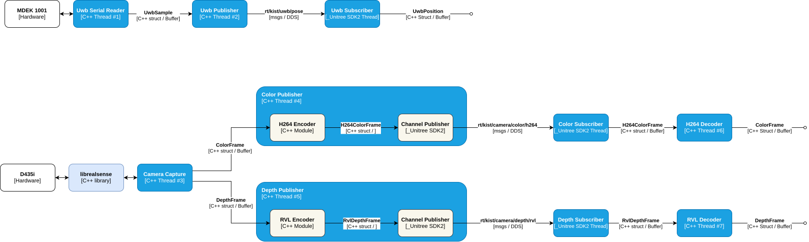

# kist-ext-sensor-io

External (attached) sensor I/O for the KIST G1 stack

Sensors: UWB (Decawave DWM1001-dev), RealSense camera(D435i)

## Architecture

[](docs/kist-ext-sensor-io.svg)

## Dependencies

| Component | Version | Role |
|---|---|---|
| `unitree_sdk2` | `21d0a3b` | DDS client + ROS2 `PoseStamped` IDL |
| CycloneDDS + CycloneDDS-CXX | 0.10.2 | `idlc`/`idlcxx` codegen for the custom DDS types |
| `librealsense2` | 2.58.1 | RealSense capture |
| x264 | distro | H.264 color encode |
| FFmpeg / libav | distro | H.264 color decode |
| OpenCV | distro | viewer probe |
| `yaml-cpp` | distro | config parsing |

## Installation

#### 1. Clone Repository

```bash
git clone https://github.com/Safety-Node/kist-ext-sensor-io.git
cd kist-ext-sensor-io
```

All following steps run from the repository root.

#### Quick Start with Docker

The image bakes in everything below (SDK, packages, libraries, and the build):

```bash
./docker/build.sh      # builds the image (docker build -t kist-ext-sensor-io)
./docker/run.sh        # shell in the container; prebuilt binaries under build/
```

`run.sh` wires `--network host` (DDS), `--privileged -v /dev` (RealSense USB +
`/dev/uwb`), and X11 (viewer). The numbered steps below are the manual
(non-Docker) alternative; the UWB udev rule is host-side either way.

#### 2. Install unitree_sdk2

```bash
git clone https://github.com/unitreerobotics/unitree_sdk2.git thirdparty/unitree_sdk2
git -C thirdparty/unitree_sdk2 checkout 21d0a3b2c46ee48c8fdf2783becb6be3beb0a59b
```

#### 3. Install apt packages

```bash
sudo apt update && sudo apt install -y \
    build-essential cmake git pkg-config \
    libyaml-cpp-dev \
    libx264-dev libavcodec-dev libavutil-dev libswscale-dev libopencv-dev \
    libusb-1.0-0-dev libudev-dev libssl-dev
```

#### 4. Install CycloneDDS (idlc toolchain)

CycloneDDS + CycloneDDS-CXX 0.10.2 into `/opt/cyclonedds`, pinned to match the
SDK's bundled `libddscxx`:

```bash
git clone --depth 1 -b 0.10.2 https://github.com/eclipse-cyclonedds/cyclonedds.git /tmp/cyclonedds
cmake -S /tmp/cyclonedds -B /tmp/cyclonedds/build \
    -DCMAKE_INSTALL_PREFIX=/opt/cyclonedds -DBUILD_IDLC=ON -DCMAKE_BUILD_TYPE=Release
sudo cmake --build /tmp/cyclonedds/build --target install -j"$(nproc)"

git clone --depth 1 -b 0.10.2 https://github.com/eclipse-cyclonedds/cyclonedds-cxx.git /tmp/cyclonedds-cxx
cmake -S /tmp/cyclonedds-cxx -B /tmp/cyclonedds-cxx/build \
    -DCMAKE_INSTALL_PREFIX=/opt/cyclonedds -DCMAKE_PREFIX_PATH=/opt/cyclonedds -DCMAKE_BUILD_TYPE=Release
sudo cmake --build /tmp/cyclonedds-cxx/build --target install -j"$(nproc)"

export PATH=/opt/cyclonedds/bin:$PATH      # idlc on PATH for Build
```

#### 5. Install librealsense2

From source, library only (no examples / CUDA):

```bash
git clone --depth 1 -b v2.58.1 https://github.com/realsenseai/librealsense.git /tmp/librealsense
cmake -S /tmp/librealsense -B /tmp/librealsense/build -DCMAKE_BUILD_TYPE=Release \
    -DBUILD_EXAMPLES=false -DBUILD_GRAPHICAL_EXAMPLES=false -DBUILD_WITH_CUDA=false
sudo cmake --build /tmp/librealsense/build --target install -j"$(nproc)" && sudo ldconfig
```

#### 6. UWB udev rule (optional)

Convenience only — pins the DWM dongle (DWM1001-DEV: SEGGER J-Link OB,
VID=1366 PID=0105) to a stable `/dev/uwb` and makes it user-accessible:

```bash
echo 'SUBSYSTEM=="tty", ATTRS{idVendor}=="1366", ATTRS{idProduct}=="0105", SYMLINK+="uwb", MODE="0666"' \
  | sudo tee /etc/udev/rules.d/99-uwb.rules
sudo udevadm control --reload && sudo udevadm trigger
```

Or skip it and point `uwb.serial_port` in `config/config.yaml` at the actual
node (e.g. `/dev/ttyACM0`).

## Build

With Docker, run this inside the container (`./docker/run.sh`).

```bash
cmake -B build && cmake --build build
```

## Usage

Each sensor is a pair of own-no-thread **assemblies** — a `*Transmitter`
(device side: read → encode → publish) and a `*Receiver` (consumer side:
subscribe → decode → buffer). Link the assembly you need and drive it
in-process; config parsing lives in the caller.

### Embed the Rx side (consumer app)

```cmake
add_subdirectory(kist-ext-sensor-io)
target_link_libraries(your_app PRIVATE uwb_receiver)   # and/or realsense_receiver
```

```cpp
#include "system/uwb_receiver.hpp"

kist::UwbReceiver rx;
if (!rx.start(domain_id, network_interface))
    return 1;

// poll from any thread; empty buffer = no fix for 1s (watchdog)
auto fix = rx.fix().GetDataWithTime();
if (fix.HasData())
    use(*fix.data);

rx.stop();
```

RealSense is identical in shape — link `realsense_receiver`, then read
`rx.color()` / `rx.depth()` for the decoded frames.

Optional, before `start()`: react to every fix on arrival (runs on the DDS
receive thread — keep it cheap):

```cpp
rx.set_on_position([](const kist::UwbPosition& p) { /* forward p */ });
```

### Run standalone (device / testing)

Each assembly has a runner that reads `config/config.yaml`:

```bash
./build/test_uwb_transmitter           # device:   DWM dongle -> DDS
./build/test_uwb_receiver              # consumer: prints received fixes

./build/test_realsense_transmitter     # device:   D435i -> DDS
./build/test_realsense_receiver        # consumer: prints fps
./build/test_realsense_receiver_viewer # consumer: shows color | depth
```
